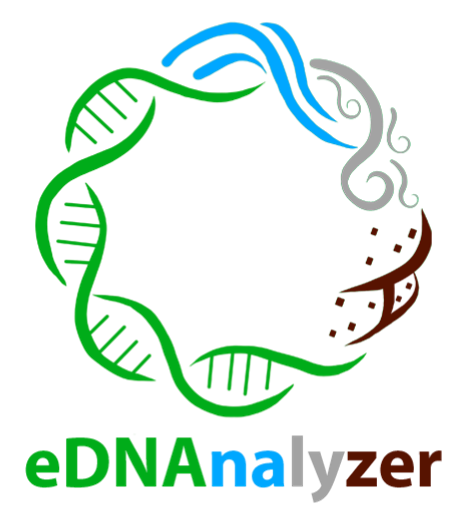

# Taxonomic assignment analysis from _metabarcoding_ of eDNA and iDNA

## Applies reads threshold and generates tables with taxon lists from the raw table of taxonomic assignments in .xlsx or .csv.

This repository contains the program's executable file, which can be downloaded and used normally, but the files with the source code are also available.  
The program's manual explains how to make the input files and how to use its interface.

The manual is also available [here](https://ednanalyzer-manual.netlify.app).

**How to cite eDNAnalyzer?**  
Olimpio, L.W.G.F.; Gestich, C.C.; Saranholi, B.H.; Galetti Jr, P.M.; Freitas, P.D. 2025. eDNAnalyzer: a user-friendly computational tool for post-processing taxonomic assignment data derived from eDNA and iDNA metabarcoding (doi: ).

---

# Análise de atribuição taxonômica proveneiente de _metabarcoding_ de eDNA e iDNA

## Aplica threshold de reads e gera tabelas com as listas de táxons a partir de tabela bruta das atribuições taxonômicas em .xlsx ou .csv

Nesse repositório está depositado o arquivo executável do programa que pode ser baixado e utilizado normalmente, porém também estão disponíveis os arquivos com o código-fonte.  
O manual do programa explica como devem ser feitos os arquivos de entrada e como utilizar sua interface.

O manual também está disponível [aqui](https://ednanalyzer-manual.netlify.app).

**Como citar eDNAnalyzer?**  
Olimpio, L.W.G.F.; Gestich, C.C.; Saranholi, B.H.; Galetti Jr, P.M.; Freitas, P.D. 2025. eDNAnalyzer: a user-friendly computational tool for post-processing taxonomic assignment data derived from eDNA and iDNA metabarcoding (doi: ).
